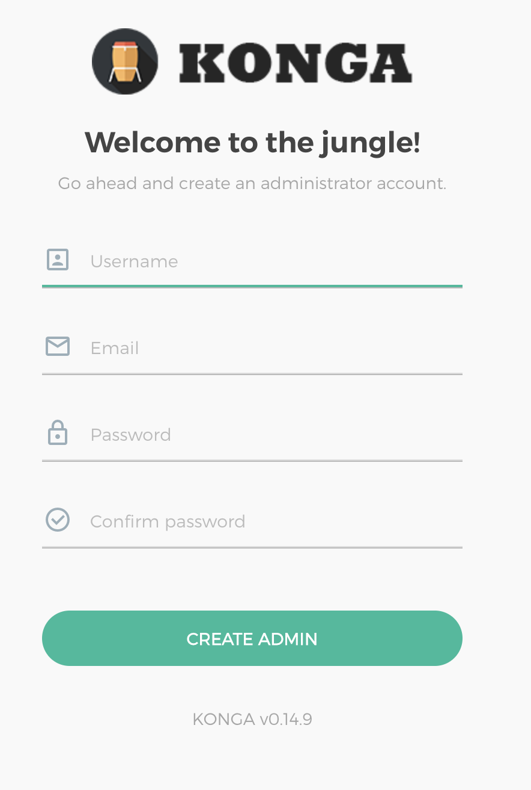
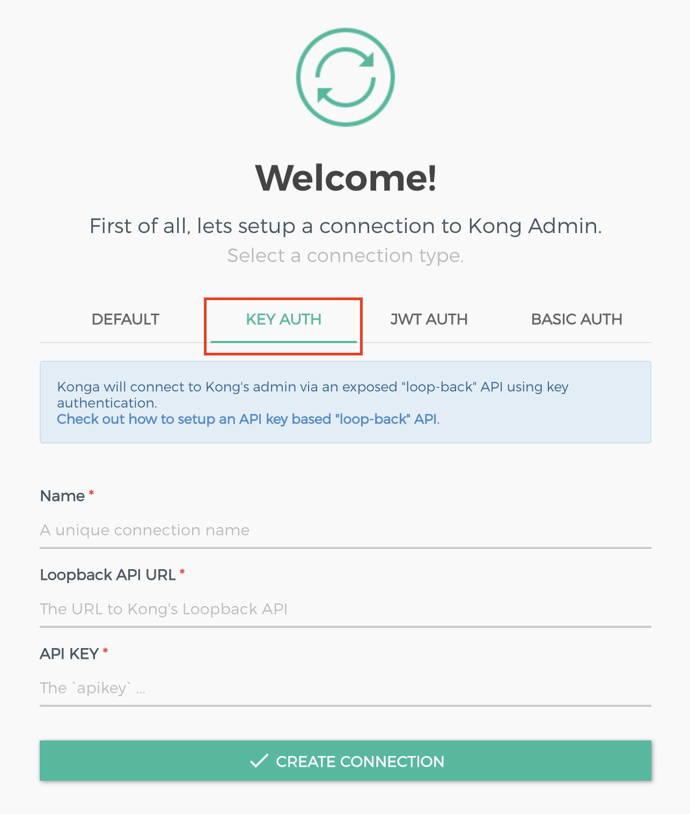

# Experimento 2

## Objetivo

El objetivo de este experimento es demostrar las estrategias de seguridad para la aplicación utilizando un API Gateway.

## Requisitos

- Tener instalado [Docker](https://docs.docker.com/install/)
- Tener instalado [Docker Compose](https://docs.docker.com/compose/install/)

## Despliegue

Para desplegar la aplicación, ejecutar el siguiente comando:

```bash
KONG_DATABASE=postgres docker compose --profile database up
```

Este comando desplegará:

- Una base de datos PostgreSQL
- Un API Gateway Kong
- Una aplicación de ejemplo en Flask
- Konga (Dashboard)

## Explicación servicios desplegados

### Base de datos

La base de datos se desplegará en el puerto 5432. El usuario y contraseña de la base de datos es `kong`. La base de
datos se llama `kong`.

### API Gateway

El API Gateway se desplegará en el puerto 8000. El administrador del API Gateway se desplegará en el puerto 8001.

### Aplicación

La aplicación se desplegará en el puerto 5000. La aplicación tiene 4 endpoints:

- `/api/v1/endpoint1` - Endpoint público
- `/api/v1/endpoint2` - Endpoint protegido por OAuth2
- `/api/v1/endpoint3` - Endpoint protegido por JWT
- `/api/v1/endpoint4` - Endpoint protegido por OAuth2 y Rate Limiting

 Esta app corre en el puerto 5000, sin embargo este no es expuesto ya que correra en la red privada de docker y sólo podrá ser accesado por otros servicios (el API Gateway lo expone). Para exponer la app descomentar la configuración de port en de la app en [docker-compose.yml](docker-compose.yml#L28)

### Dashboard

El dashboard se desplegará en el puerto 8080. Este dashboard utiliza el API Gateway para obtener la información de
los servicios desplegados. Se utiliza Konga para el dashboard.

## Configuración

### Konga

#### Crear usuario de Konga

Para crear un usuario de Konga, ir a la url del dashboard de Konga (http://localhost:8080) y crear un usuario.



#### Generar un token de acceso para Konga (Dashboard)

Como estandar de seguridad, se debe proteger el admin API de Kong mediante un token de acceso, así Konga puede acceder
al API Gateway.

Para generar un token de acceso para Konga, ejecutar el siguiente comando:

```bash
./scripts/create-admin-key-auth.sh
```

Este comando generará un token de acceso para Konga. El token de acceso se mostrará en la consola al igual que los demás
campos qu debe llenar en Konga.



## Kong

### Crear un servicio

WIP (Video???)

##  OAuth2 Server

We provide a mock server for Oauth2 requests that runs public in [http://localhost:8080/](http://localhost:8080/) based on OpenID Connect specification (On top of Oauth2) which can be accesed from [http://localhost:8080/default/.well-known/openid-configuration](http://localhost:8080/default/.well-known/openid-configuration)
